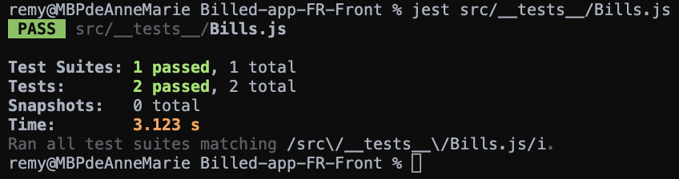
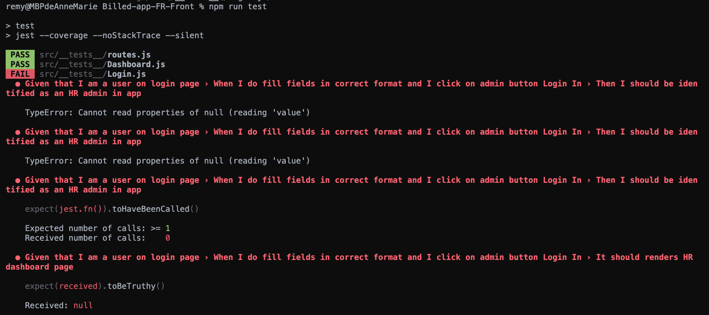
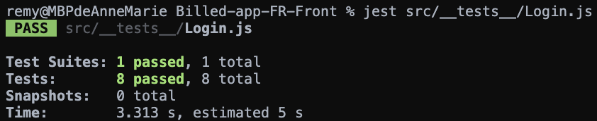
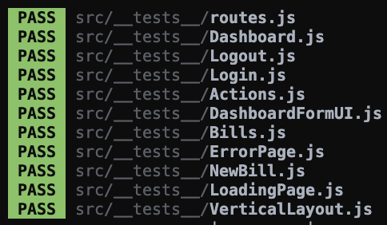
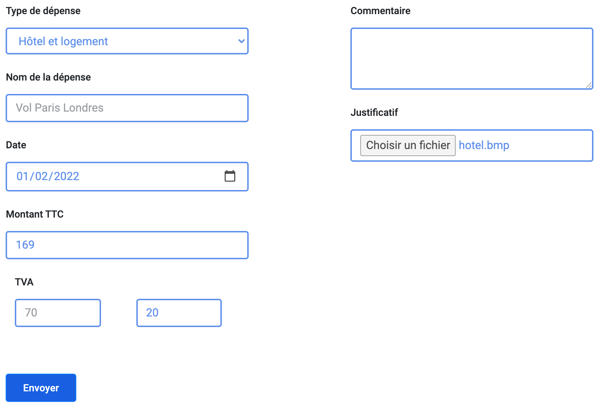
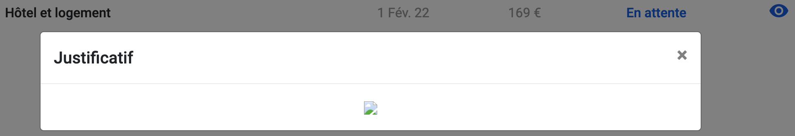
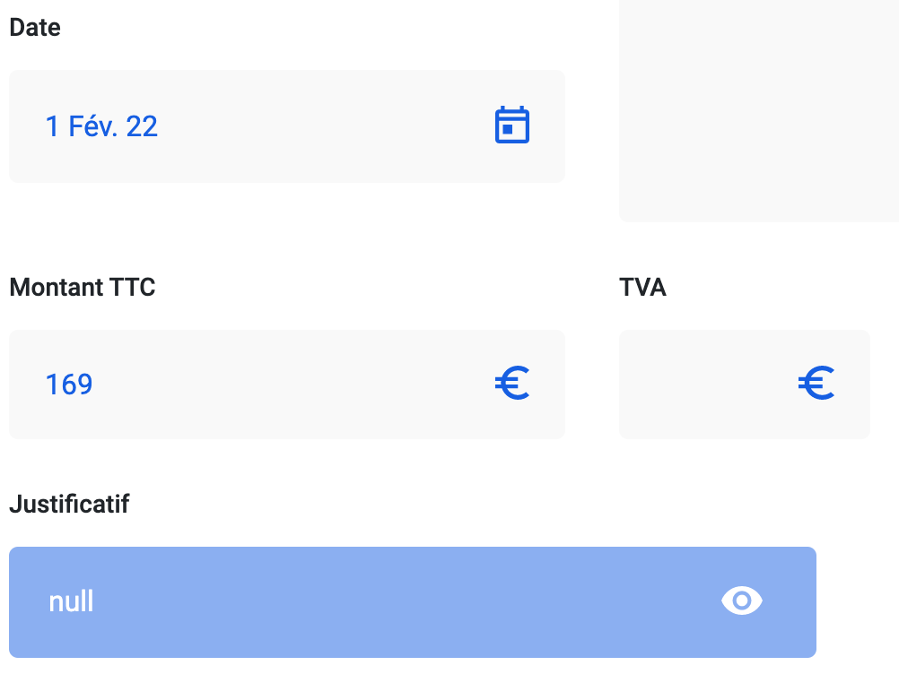
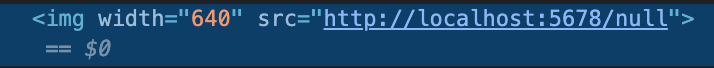
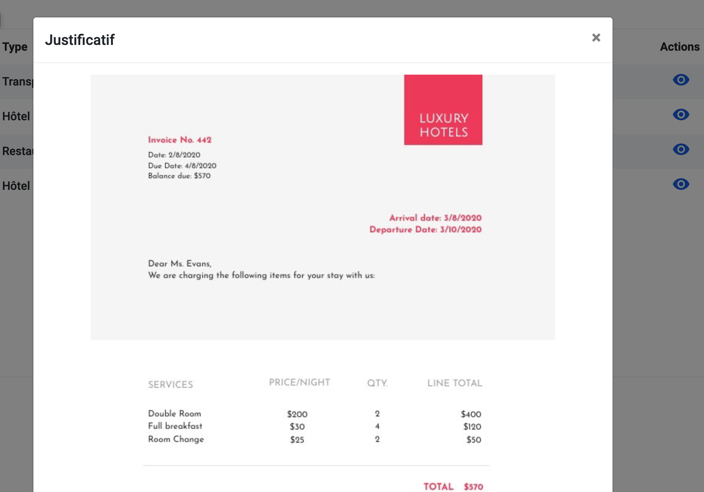
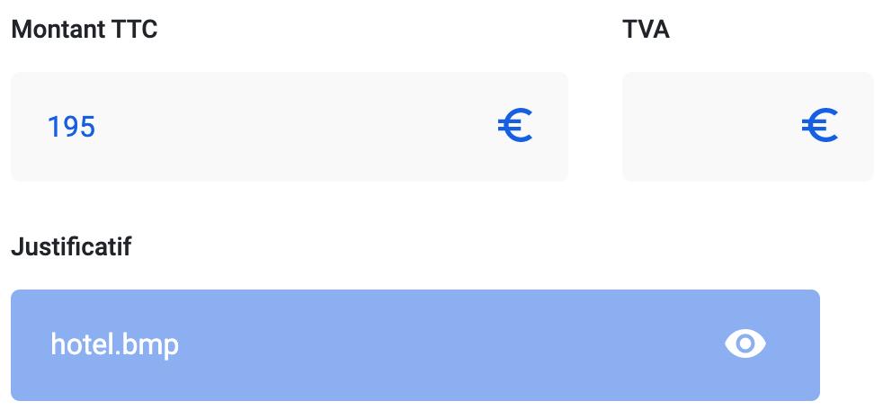

***

- [1. Bug report - Bills](#1-bug-report---bills)
- [2. Bug report - Login](#2-bug-report---login)
- [3. All tests passed](#3-all-tests-passed)
- [4. Bug hunt - Bills](#4-bug-hunt---bills)
  
***

## 1. Bug report - Bills

Le test ci-dessous nous démontre que l'affichage des notes de frais n'est pas conforme aux attentes.  
Les notes devraient apparaître de la plus récente à la plus ancienne.


Nous pouvons constater dans le fichier [Billed-app-FR-Front/src/views/BillsUI.js](Billed-app-FR-Front/src/views/BillsUI.js) que la fonction suivante...

```js
const rows = (data) => {
  return (data && data.length) ? data.map(bill => row(bill)).join("") : ""
}
```

... crée une ***map*** des notes de frais sans opérer de tri préalable.

La création d'une fonction de comparaison assignée à la méthode ***.sort()*** et appliquée à ***data*** avant la création de la ***map*** va permettre un affichage conforme.

```js
const rows = (data) => {

  const ByDate = (a, b) => {
    if (a.date < b.date) {
      return 1;
    }
    if (a.date > b.date) {
      return -1;
    }
    return 0;
  };

  return (data && data.length) ? data.sort(ByDate).map(bill => row(bill)).join("") : ""
  
}
```

Le test passe maintenant au vert.



***

## 2. Bug report - Login

Le test suivant met en évidence l'impossibilité de se connnecter en tant qu'administrateur malgré des identifiants corrects.



La méthode ***.handleSubmitAdmin()*** de la classs ***Login*** située dans le fichier [Billed-app-FR-Front/src/containers/Login.js](Billed-app-FR-Front/src/containers/Login.js) récupère les données de l'***input*** en ciblant l'attribut ***data-testid***.

```js
handleSubmitAdmin = e => {
  e.preventDefault()
  const user = {
    type: "Admin",
    email: e.target.querySelector(`input[data-testid="employee-email-input"]`).value,
    password: e.target.querySelector(`input[data-testid="employee-password-input"]`).value,
    status: "connected"
  }
```    
Dans le cas présent, sont ciblés les ***input*** du formulaire _employé_ et l'identification n'est pas possible en mode _admin_.

La correction ci-dessous permet de récupérer les bonnes valeurs en ciblant les ***input*** du formulaire _admin_ et ainsi de se connecter :

```js
handleSubmitAdmin = e => {
  e.preventDefault()
  const user = {
    type: "Admin",
    email: e.target.querySelector(`input[data-testid="admin-email-input"]`).value,
    password: e.target.querySelector(`input[data-testid="admin-password-input"]`).value,
    status: "connected"
  }
```

Le test passe :



***

## 3. All tests passed



***

## 4. Bug hunt - Bills

Le justificatif d'une note de frais n'apparait pas si son format est autre que ***jpg***, ***png*** ou ***jpeg***.

Exemple ci-dessous lors de la créaton d'une note avec un justificatif au format ***bmp*** :



La pièce jointe ne s'affiche pas en mode _employé_ :



Ni en mode _admin_ :



L'inspecteur de _Google Chrome_ indique une adresse ***null*** de l'image, provenant du port utilisé par le _back-end_.



Dans le fichier [Billed-app-FR-Back/controllers/bill.js](Billed-app-FR-Back/controllers/bill.js), la fonction suivante...

```js
const isPicture = (mimeType) => ['image/jpeg', 'image/jpg', 'image/png', 'image/gif'].includes(mimeType);
```

... teste les pièces-jointes et retourne ***true*** ou ***false*** en fonction des types _mime_ déclarés dans le tableau et du type de justificatif testé.

Plus loing dans le fichier, on peut voir lors de la création d'une note de frais que le chemin et le nom de l'image ne seront créés que si le type _mime_ est reconnu par la fontion ***isPicture()*** :

```js
const bill = await Bill.create({
      name,
      type,
      email,
      date,
      vat,
      pct,
      commentary,
      status,
      commentAdmin,
      fileName: isPicture(file.mimetype) ? file.originalname : 'null',
      filePath: isPicture(file.mimetype) ? file.path : 'null',
      amount,
    });
```

Pour garantir une prise en charge de tous les types d'images, une modification de la fonction ***isPicture()*** est nécessaire, en ajoutant les types mime que nous validerons :

```js
const isPicture = (mimeType) => ['image/jpeg', 'image/jpg', 'image/png', 'image/gif', 'image/bmp', 'image/webp', 'image/svg+xml'].includes(mimeType);
```

Les justificatifs en _bmp_, par éxemple, s'affichent correctement et dans les deux modes de connexion :

_Employé_



_Admin_



Par la suite, et afin de limiter les formats d'images acceptés (***png, jpg*** et ***jpeg*** seulement), il est simple d'ajouter un attribut ***accept*** à l'***input*** de type ***file*** dans le fichier [Billed-app-FR-Front/src/views/NewBillUI.js](Billed-app-FR-Front/src/views/NewBillUI.js)

```html
<div class="col-half">
  <label for="file" class="bold-label">Justificatif ( PNG, JPG ou JPEG uniquement )</label>
  <input required type="file" accept="image/png, image/jpg, image/jpeg" class="form-control blue-border" data-testid="file" />
</div>
```

La selection d'un autre type de fichier image est alors impossible.

Ajout d'une mention afin d'avertir l'utilisateur :

" src="supply/_img_README/modif-label.png" width="400">

***