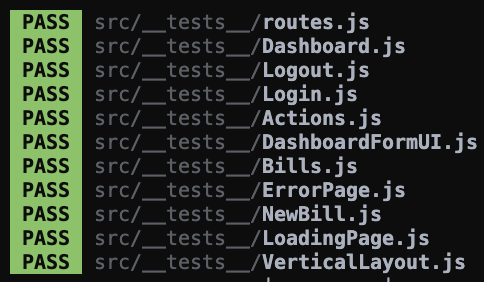

***

- [1. Bug report - Bills](#1-bug-report---bills)
- [2. Bug report - Login](#2-bug-report---login)
- [3. All tests passed](#3-all-tests-passed)
  
***

## 1. Bug report - Bills

Le test ci-dessous nous démontre que l'affichage des notes de frais n'est pas conforme aux attentes.  
Les notes devraient apparaître de la plus récente à la plus ancienne.


Nous pouvons constater dans le fichier [src/views/BillsUI.js](Billed-app-FR-Front/src/views/BillsUI.js) que la fonction suivante...

```js
const rows = (data) => {
  return (data && data.length) ? data.map(bill => row(bill)).join("") : ""
}
```

...crée une ***map*** des notes de frais sans opérer de tri préalable.

La création d'une fonction de comparaison assignée à la méthode ***.sort()*** et appliquée à ***data*** avant la création de la ***map*** va permettre un affichage conforme aux attentes.

```js
const rows = (data) => {

  const ByDate = (a, b) => {
    if (a.date < b.date) {
      return 1;
    }
    if (a.date > b.date) {
      return -1;
    }
    return 0;
  };

  return (data && data.length) ? data.sort(ByDate).map(bill => row(bill)).join("") : ""
  
}
```

Le test passe maintenant au vert.


***

## 2. Bug report - Login

Le test suivant met en évidence l'impossibilité de se connnecter en tant qu'administrateur malgré des identifiants correct.


La méthode ***.handleSubmitAdmin()*** de la classs ***Login*** située dans le fichier [src/containers/Login.js](Billed-app-FR-Front/src/containers/Login.js) récupère les données de l'***input*** en ciblant l'attribut ***data-testid***.

```js
handleSubmitAdmin = e => {
  e.preventDefault()
  const user = {
    type: "Admin",
    email: e.target.querySelector(`input[data-testid="employee-email-input"]`).value,
    password: e.target.querySelector(`input[data-testid="employee-password-input"]`).value,
    status: "connected"
  }
```    
Dans le cas présent, sont ciblés les ***input*** du formulaire _employé_ et l'identification n'est pas possible en mode _admin_.

La correction ci-dessous permet de récupérer les bonnes valeurs et de se connecter :

```js
handleSubmitAdmin = e => {
  e.preventDefault()
  const user = {
    type: "Admin",
    email: e.target.querySelector(`input[data-testid="admin-email-input"]`).value,
    password: e.target.querySelector(`input[data-testid="admin-password-input"]`).value,
    status: "connected"
  }
```

Le test passe :


***

## 3. All tests passed



***
