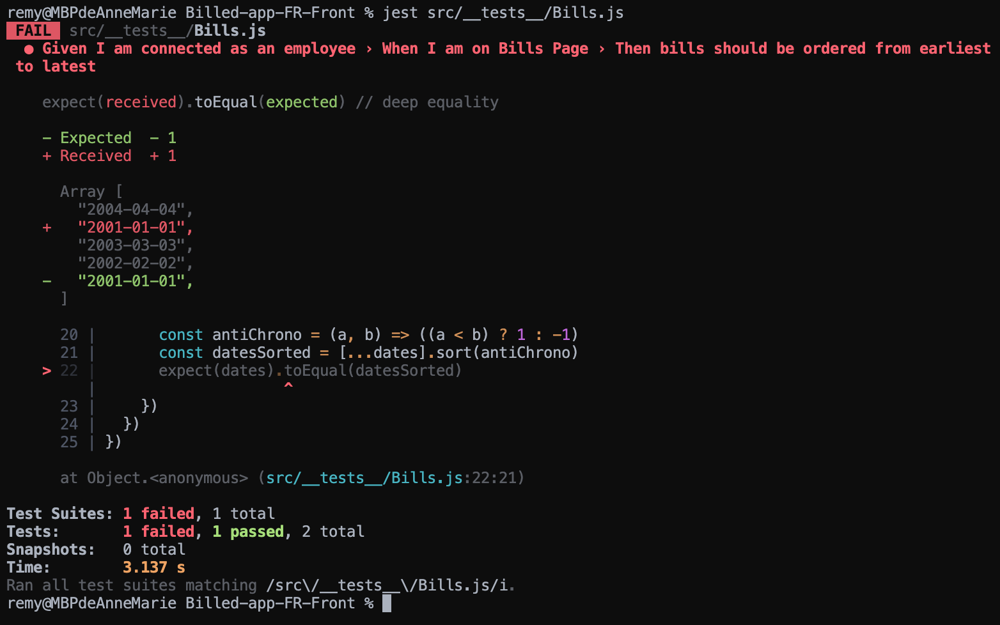
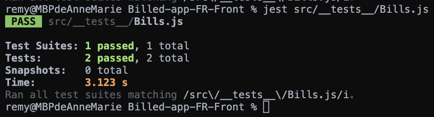

***

## Bug report - Bills

Le test ci-dessous nous démontre que l'affichage des notes de frais n'est pas conforme aux attentes.  
Les notes devraient apparaître de la plus récente à la plus ancienne.



Nous pouvons constater dans le fichier [src/views/BillsUI.js](Billed-app-FR-Front/src/views/BillsUI.js) que la fonction suivante...

```js
const rows = (data) => {
  return (data && data.length) ? data.map(bill => row(bill)).join("") : ""
}
```

...crée une _map_ des notes de frais sans opérer de tri préalable.

La création d'une fonction de comparaison assignée à la méthode _.sort()_ et appliquée à _data_ avant la création de la _map_ va permettre un affichage conforme aux attentes.

```js
const rows = (data) => {

  const ByDate = (a, b) => {
    if (a.date < b.date) {
      return 1;
    }
    if (a.date > b.date) {
      return -1;
    }
    return 0;
  };

  return (data && data.length) ? data.sort(ByDate).map(bill => row(bill)).join("") : ""
  
}
```

Le test passe maintenant au vert.



***
