# 1. Billed

Projet N°6 du parcours _Développeur Front-End_ [OpenClassrooms](https://openclassrooms.com/fr/).

  
  


## 1.1. Débugger et tester un SaaS RH

- Ecrire des tests unitaires avec JavaScript
- Débuggger une application web avec Chrome Debugger
- Rédiger un plan de test end-to-end
- Ecrire des tests d'intégration avec JavaScript

***

- [1. Billed](#1-billed)
  - [1.1. Débugger et tester un SaaS RH](#11-débugger-et-tester-un-saas-rh)
  - [1.2. Correction des bugs](#12-correction-des-bugs)
    - [1.2.1. Bug report - Bills](#121-bug-report---bills)
    - [1.2.2. Bug report - Login](#122-bug-report---login)
    - [1.2.3. Bug hunt - Bills](#123-bug-hunt---bills)
      - [1.2.3.1. Solution alternative](#1231-solution-alternative)
    - [1.2.4. Bug hunt - Dashboard](#124-bug-hunt---dashboard)
    - [1.2.5. All tests Pass](#125-all-tests-pass)
  - [1.3. Ajout de tests unitaires et d'intégration](#13-ajout-de-tests-unitaires-et-dintégration)
    - [1.3.1. Highlighted bill icon](#131-highlighted-bill-icon)
  
***

## 1.2. Correction des bugs

### 1.2.1. Bug report - Bills

Le test ci-dessous nous démontre que l'affichage des notes de frais n'est pas conforme aux attentes.  
Les notes devraient apparaître de la plus récente à la plus ancienne.

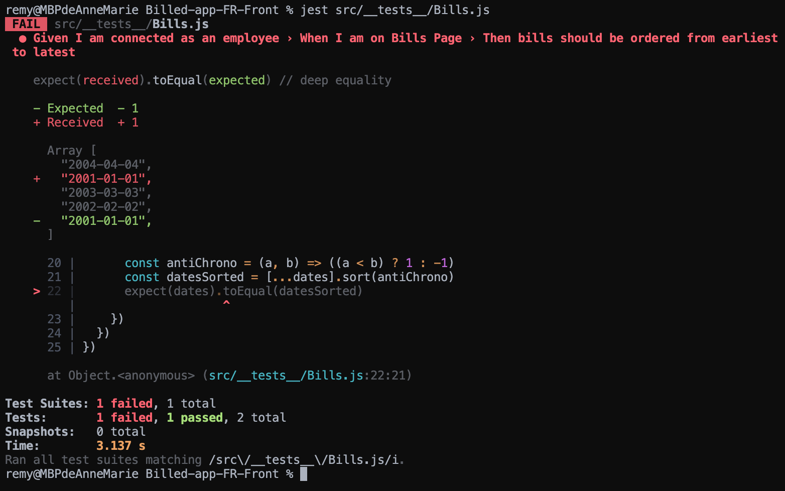

Nous pouvons constater dans le fichier [Billed-app-FR-Front/src/views/BillsUI.js](Billed-app-FR-Front/src/views/BillsUI.js) que la fonction suivante...

```js
const rows = (data) => {
  return (data && data.length) ? data.map(bill => row(bill)).join("") : ""
}
```

...crée une ***map*** des notes de frais sans opérer de tri préalable.

La création d'une fonction de comparaison assignée à la méthode ***.sort()*** et appliquée à ***data*** avant la création de la ***map*** va permettre un affichage conforme.

```js
const rows = (data) => {

  const ByDate = (a, b) => {
    if (a.date < b.date) {
      return 1;
    }
    if (a.date > b.date) {
      return -1;
    }
    return 0;
  };

  return (data && data.length) ? data.sort(ByDate).map(bill => row(bill)).join("") : ""
  
}
```

Le test passe maintenant au vert.

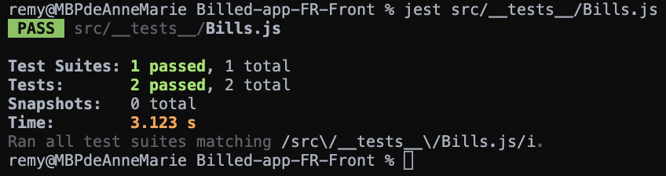

### 1.2.2. Bug report - Login

Le test suivant met en évidence l'impossibilité de se connnecter en tant qu'administrateur malgré des identifiants corrects.

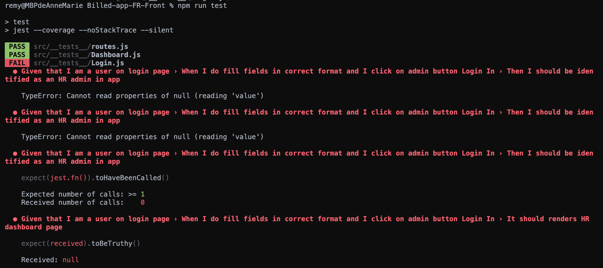

La méthode ***.handleSubmitAdmin()*** de la classs ***Login*** située dans le fichier [Billed-app-FR-Front/src/containers/Login.js](Billed-app-FR-Front/src/containers/Login.js) récupère les données de l'***input*** en ciblant l'attribut ***data-testid***.

```js
handleSubmitAdmin = e => {
  e.preventDefault()
  const user = {
    type: "Admin",
    email: e.target.querySelector(`input[data-testid="employee-email-input"]`).value,
    password: e.target.querySelector(`input[data-testid="employee-password-input"]`).value,
    status: "connected"
  }
```    
Dans le cas présent, sont ciblés les ***input*** du formulaire _employé_ et l'identification n'est pas possible en mode _admin_.

La correction ci-dessous permet de récupérer les bonnes valeurs en ciblant les ***input*** du formulaire _admin_ et ainsi de se connecter :

```js
handleSubmitAdmin = e => {
  e.preventDefault()
  const user = {
    type: "Admin",
    email: e.target.querySelector(`input[data-testid="admin-email-input"]`).value,
    password: e.target.querySelector(`input[data-testid="admin-password-input"]`).value,
    status: "connected"
  }
```

Le test passe :

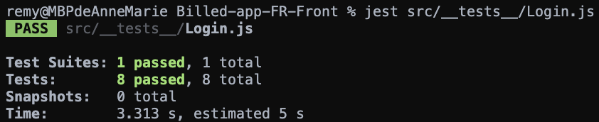

### 1.2.3. Bug hunt - Bills

Le justificatif d'une note de frais n'apparait pas si son format est autre que ***jpg***, ***png*** ou ***jpeg***.

Exemple ci-dessous lors de la créaton d'une note avec un justificatif au format ***bmp*** :

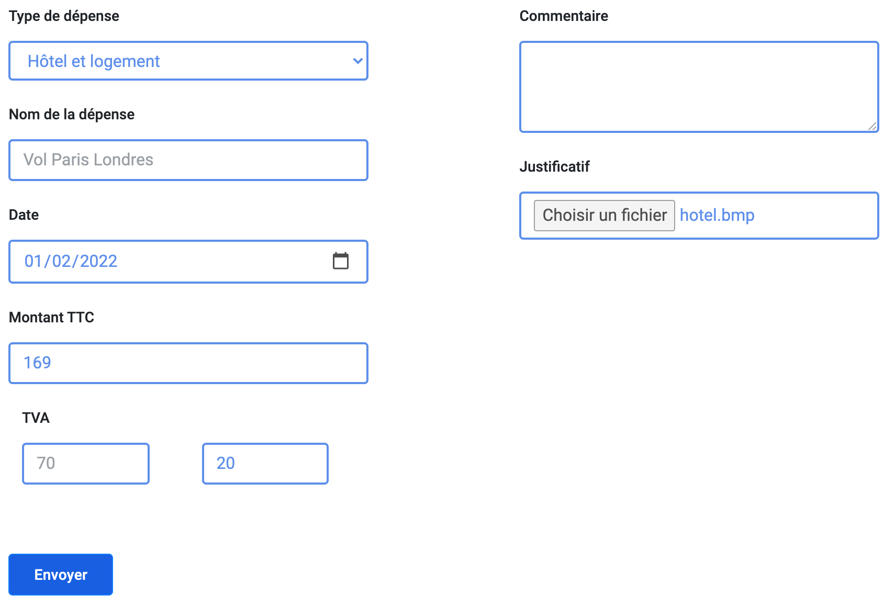

La pièce jointe ne s'affiche pas en mode _employé_ :


Ni en mode _admin_ :

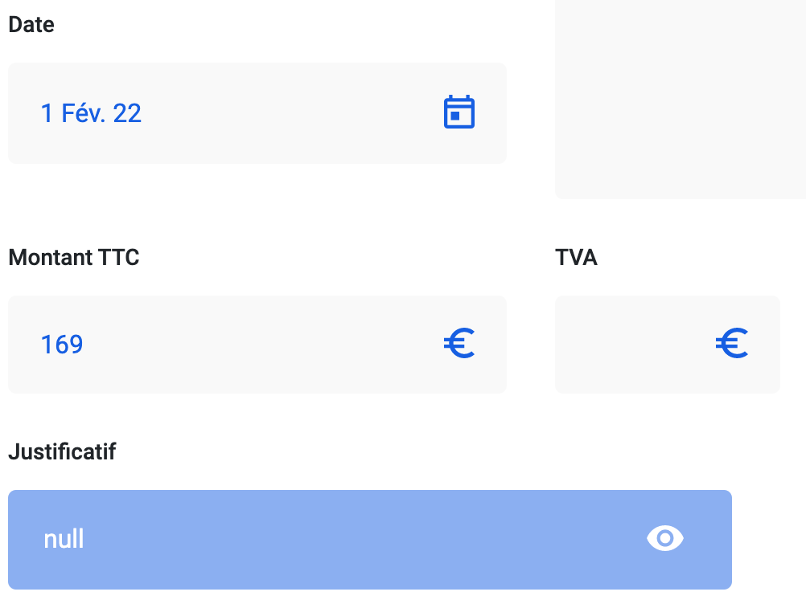

L'inspecteur de _Google Chrome_ indique une adresse ***null*** de l'image, provenant du port utilisé par le _back-end_.

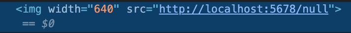

Dans le fichier [Billed-app-FR-Back/controllers/bill.js](Billed-app-FR-Back/controllers/bill.js), la fonction suivante...

```js
const isPicture = (mimeType) => ['image/jpeg', 'image/jpg', 'image/png', 'image/gif'].includes(mimeType);
```

... teste les pièces-jointes et retourne ***true*** ou ***false*** en fonction des types _mime_ déclarés dans le tableau et du type de justificatif testé.

Plus loing dans le fichier, on peut voir lors de la création d'une note de frais que le chemin et le nom de l'image ne seront créés que si le type _mime_ est reconnu par la fontion ***isPicture()*** :

```js
const bill = await Bill.create({
      name,
      type,
      email,
      date,
      vat,
      pct,
      commentary,
      status,
      commentAdmin,
      fileName: isPicture(file.mimetype) ? file.originalname : 'null',
      filePath: isPicture(file.mimetype) ? file.path : 'null',
      amount,
    });
```

Pour garantir une prise en charge de tous les types d'images, une modification de la fonction ***isPicture()*** est nécessaire, en ajoutant les types mime que nous validerons :

```js
const isPicture = (mimeType) => ['image/jpeg', 'image/jpg', 'image/png', 'image/gif', 'image/bmp', 'image/webp', 'image/svg+xml'].includes(mimeType);
```

Les justificatifs en _bmp_, par éxemple, s'affichent correctement et dans les deux modes de connexion :

_Employé_

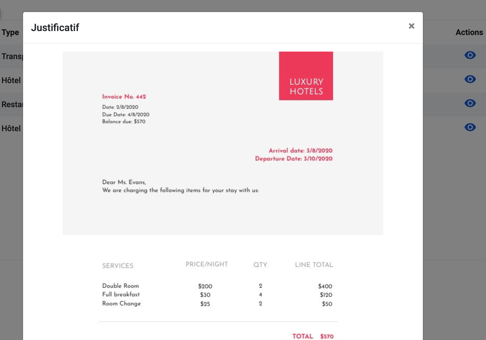

_Admin_

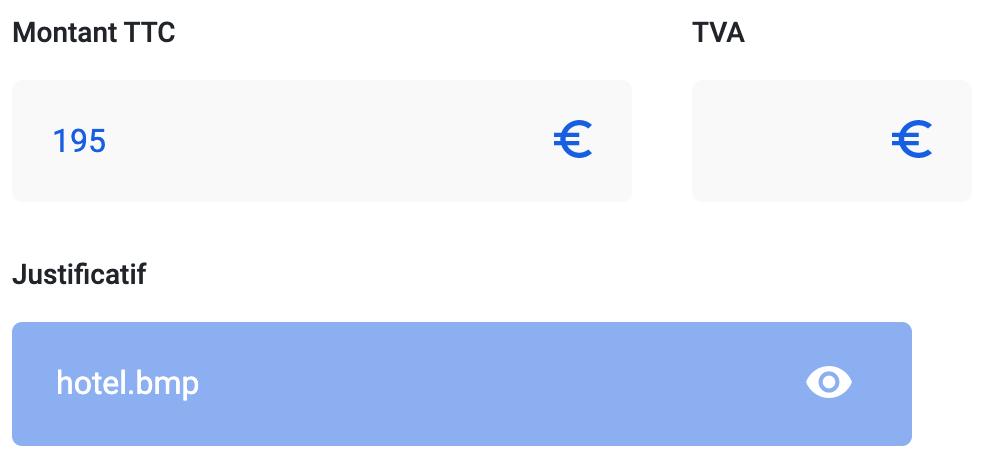

#### 1.2.3.1. Solution alternative

Afin de limiter les formats d'images acceptés (***png, jpg*** et ***jpeg*** seulement), il est simple d'ajouter un attribut ***accept*** à l'***input*** de type ***file*** dans le fichier [Billed-app-FR-Front/src/views/NewBillUI.js](Billed-app-FR-Front/src/views/NewBillUI.js)

```html
<div class="col-half">
  <label for="file" class="bold-label">Justificatif ( PNG, JPG ou JPEG uniquement )</label>
  <input required type="file" accept="image/png, image/jpg, image/jpeg" class="form-control blue-border" data-testid="file" />
</div>
```

La selection d'un autre type de fichier image est alors impossible.

Ajout d'une mention afin d'avertir l'utilisateur :

" src="supply/img_README/modif-label.png" width="400">

### 1.2.4. Bug hunt - Dashboard

Connecté en tant qu'administrateur, la navigation entre les statuts  des notes de frais ne fonctionne pas correctement.  
Le retour à un statut précédement consulté n'affiche plus les notes de frais concernées.

C'est la méthode ***handleEditTicket()*** de la classe ***Dashboard*** qui gère l'édition des notres de frais.

```js
handleEditTicket(e, bill, bills) {

  if (this.counter === undefined || this.id !== bill.id) this.counter = 0
  if (this.id === undefined || this.id !== bill.id) this.id = bill.id
  if (this.counter % 2 === 0) {

    bills.forEach(b => {$(`#open-bill${b.id}`).css({background: '#0D5AE5'})})

    $(`#open-bill${bill.id}`).css({background: '#2A2B35'})

    $('.dashboard-right-container div').html(DashboardFormUI(bill))

    $('.vertical-navbar').css({height: '150vh'})

    this.counter++

  } else {

    $(`#open-bill${bill.id}`).css({background: '#0D5AE5'})

    $('.dashboard-right-container div').html(`
      <div id="big-billed-icon" data-testid="big-billed-icon"> ${BigBilledIcon} </div>
    `)

    $('.vertical-navbar').css({height: '120vh'})

    this.counter++;
  }

  console.log(this.counter);
  
  $('#icon-eye-d').click(this.handleClickIconEye)
  $('#btn-accept-bill').click((e) => this.handleAcceptSubmit(e, bill))
  $('#btn-refuse-bill').click((e) => this.handleRefuseSubmit(e, bill))
  
}
```

A chaque clic sur une vignette, un compteur est incrémenté et passe d'un état de nombre pair à impair modifiant ainsi l'affichage alternativement.

En affichant dans la console le compteur, on peut voir qu'en cliquant plusieurs fois sur la même vignette, le compteur fonctionne correctement.

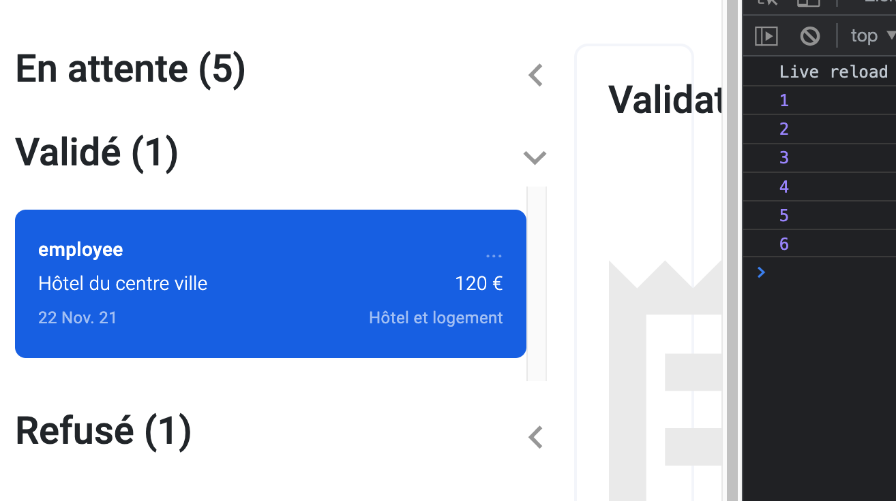

Lorsque l'on change de catégorie et que l'on revients sur une précédente vignette, on peut voir ci-dessous que le compteur est incrémenté deux fois pour un unique clic, et passe donc d'un état 'pair - impair - pair' ce qui annule la modification de l'affichage.

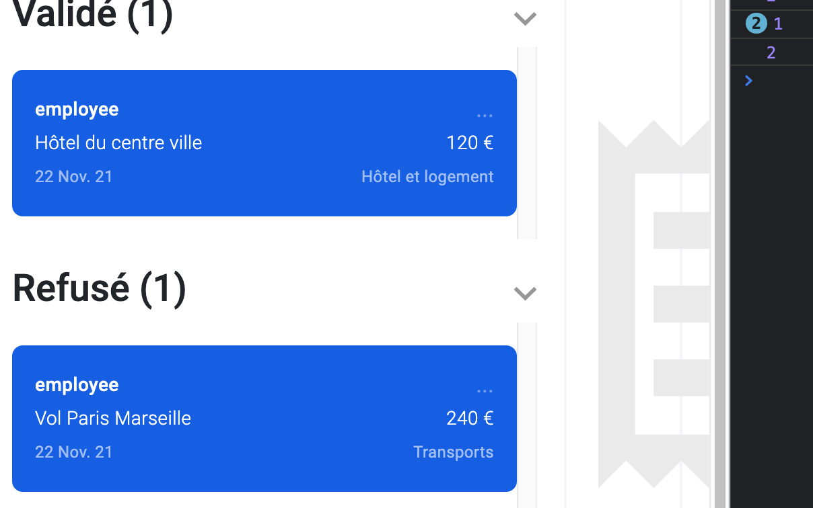

On peut en déduire qu'en changeant de type de notes de frais, nous rappelons les notes précédentes, puis celle sélectionnée, car les actions 'écoutées' pour les trois types de listes sont associés au même évennement.

Ici, cet évennement à la fin de la méthose ***handleShowTicket()*** qui nous renvoie, pour tous les types de note, à la même méthode :

```js
bills.forEach(bill => {
  $(`#open-bill${bill.id}`).click((e) => this.handleEditTicket(e, bill, bills))
})
```

En ajoutant la méthode ***stopImmediatePropagation()*** à la méthode de classe ***handleEditTicket()***, nous limitons l'appel à notre seul évennement désiré :

```js
handleEditTicket(e, bill, bills) {

  e.stopImmediatePropagation()
  ...
  ...
  ...

}
```

### 1.2.5. All tests Pass

Tous les tests sont maintenant au vert :

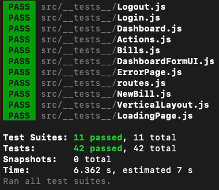

## 1.3. Ajout de tests unitaires et d'intégration

### 1.3.1. Highlighted bill icon

Lorsqu'un employé est connecté, l'icone 'fenêtre' dans le menu vertical de gauche prend un aspect de surbrillance :


Cet aspect est apporté grâce à la classe 'active-icon' :

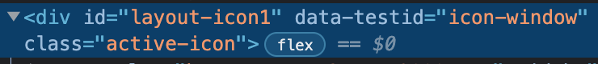

Le test ci-dessous simule la connexion d'un employé :

```js
describe("Given I am connected as an employee", () => {
  describe("When I am on Bills Page", () => {
    test("Then bill icon in vertical layout should be highlighted", async () => {
      Object.defineProperty(window, 'localStorage', { value: localStorageMock })
      window.localStorage.setItem('user', JSON.stringify({
        type: 'Employee'
      }))
      const root = document.createElement("div")
      root.setAttribute("id", "root")
      document.body.append(root)
      router()
      window.onNavigate(ROUTES_PATH.Bills)
      await waitFor(() => screen.getByTestId('icon-window'))
      const windowIcon = screen.getByTestId('icon-window')
      // expect...
    })
  })
})
```

En ajoutant l'expect suivant, nous testons si l'icone recoit bien la classe 'active-icon' :

```js
// * Le routeur injecte la classe 'active-icon' quand l'utilisateur est
// * sur la page 'Bills'
expect(windowIcon).toHaveClass('active-icon');
```

